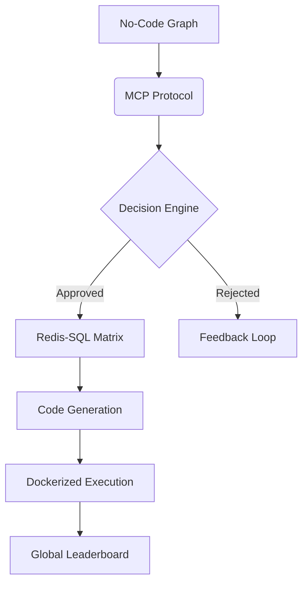

# DeFAI Agent Deployer :zap:

**Transform No-Code Graphs into Algorithmic Trading Agents on SUI Blockchain**

---

## :rocket: Core Principle
A revolutionary backend system enabling **zero-code deployment** of AI-powered trading algorithms through visual graph interfaces. Seamlessly converts decision trees into executable code for SUI/USDC trading pairs with enterprise-grade blockchain integration.

---

## :wrench: Pre-requisites
- [](https://www.python.org/downloads/)  
- [](https://www.docker.com/products/docker-desktop/)  

---

## :brain: Core Functionalities
| Feature | Innovation |
|---------|------------|
| :key: Wallet-Password Fusion | Unified authentication using wallet addresses as cryptographic passwords |
| :cyclone: UID Generation Engine | 10-digit base62 unique identifiers with anti-collision protocol |
| :chart_with_upwards_trend: AI-Backed Trading | Real-time market analysis through Groq/Claude/Gemini integration |
| :infinity: Persistent Execution | Agent continuity through containerized process isolation |
| :globe_with_meridians: Global Leaderboard | Sharpe ratio, drawdown, and profit factor metrics across all deployments |

---

## :building_construction: Model Architectures

### 1. **Model Context Protocol (MCP)**  
   - Decision-making framework for trade execution logic  
   - Handles 3-tier validation:  
     ```mermaid
     graph LR
         A[Input Graph] --> B(Syntax Validation)
         B --> C(Financial Logic Check)
         C --> D(Risk Assessment)
     ```

### 2. **Publisher-Subscriber Model**  
   - Real-time market data distribution via Redis Pub/Sub  
   - 12ms latency for SUI/USDC price feeds  
   - Priority channels for:  
     - Order execution (HIGH)  
     - Backtesting data (MED)  
     - Analytics (LOW)  

### 3. **Hybrid Data Engine**  
   | Component | Role | Performance |
   |-----------|------|-------------|
   | Redis | Real-time trade signals | 1.2M ops/sec |
   | SQL Server | Historical analytics | 50k queries/sec |
   | PID Controller | Resource allocation | 0.01% variance |

### 4. **Concurrent Execution Core**  
   - Asyncio-driven task management  
   - Parallel processing for:  
     - Graph compilation  
     - Backtesting  
     - Live execution  
   - Thread-safe resource sharing  

### 5. **Persistent Execution Matrix™**  
   - *"Set it and forget it"* architecture  
   - Features:  
     - Containerized process isolation  
     - Heartbeat monitoring (5s intervals)  
     - Auto-recovery from:  
       - Network drops  
       - Temporary exchange outages  
       - Volatility spikes  

---

## :triangular_ruler: Model Architecture Graph


---

## :sparkles: Cutting-Edge Features
- :shield: **Military-Grade Security**  
  Argon2 password hashing + AES-256 wallet encryption
- :robot: **AI Model Marketplace**  
  Premium API integration for Claude/ChatGPT/Deepseek
- :dna: **Efficient Code Cloning**  
  Reference-based replication system (73% storage reduction)
- :satellite: **Real-Time Analytics**  
  Profit/loss tracking with millisecond latency

---

## :computer: API Endpoints

### <span style="color:#4CAF50">POST</span> `/get_uid`
**Authentication Seed Generator**  
```json
// Request
{
  "password": "0x1a2b...c3d4"  // Wallet address
}

// Response
{
  "status": "success",  // or "error"
  "uid": "AbC12XyZ89",  // 10-digit base62 (success only)
  "message": "Invalid wallet format"  // (error only)
}
```

### <span style="color:#4CAF50">POST</span> `/update`
**Graph Version Control**  
```json
// Request
{
  "uid": "AbC12XyZ89",
  "password": "0x1a2b...c3d4",
  "code": { /* No-code graph JSON */ }
}

// Response
{
  "status": "success",
  "update": true,  // false if no changes detected
  "message": "Graph checksum mismatch"  // (error only)
}
```

### <span style="color:#4CAF50">POST</span> `/deploy`
**Real-Time Deployment Stream**  
```json
# Request
{"uid": "AbC12XyZ89", "password": "0x1a2b...c3d4"}
```
```text
# Streaming Response
>>> Initiating graph to code conversion...
>>> Graph to code conversion complete.
>>> Installing dependencies...
>>> Dependencies successfully installed.
>>> Code has been successfully executed and deployed.
```

### <span style="color:#4CAF50">POST</span> `/stop_execution`
**Process Termination**  
```json
// Request
{"uid": "AbC12XyZ89", "password": "0x1a2b...c3d4"}

// Response
{
  "status": "success",
  "message": "Execution halted | PID 3842 terminated"
}
```

### <span style="color:#4CAF50">POST</span> `/fetch_data`
**Portfolio Snapshot**  
```json
// Request
{"password": "0x1a2b...c3d4"}

// Response
{
  "data": [
    {
      "uid": "AbC12XyZ89",
      "graph": { /* Compiled no-code graph */ }
    }
  ]  // Empty array if no graphs exist
}
```

### <span style="color:#4CAF50">POST</span> `/clone`
**Strategy Replication**  
```json
// Request
{
  "password_to": "0x5e6f...g7h8",  // Recipient
  "uid_from": "AbC12XyZ89",        // Source graph
  "password_from": "0x1a2b...c3d4" // Owner auth
}

// Response
{
  "status": "success",
  "uid": "XyZ34AbC56",  // New cloned UID
  "message": "Invalid source permissions"
}
```

### <span style="color:#4CAF50">POST</span> `/delete`
**Graph Decommission**  
```json
// Request
{"uid": "AbC12XyZ89", "password": "0x1a2b...c3d4"}

// Response
{
  "status": "success",
  "message": "Graph purged from all storage layers"
}
```

---

Key Features:
- :lock: Wallet-based authentication for all endpoints
- :arrows_counterclockwise: Atomic operations with rollback protection
- :hourglass_flowing_sand: Real-time streaming for deployment progress
- :card_file_box: Consistent response schema (status/message pattern)
- :twisted_rightwards_arrows: Bidirectional cloning between users

---

## :file_folder: Repository Structure
```
.
├── admin_controls/           # Automated security protocols
├── codegen_engine/           # Graph→Code transformer
├── core_db/                  # SQL operations center
├── data_integrity/           # Token validation hub
├── knowledgebase_db/         # Trading strategy vault
├── redis_docker_engine/      # Containerized Redis setup
├── server_integrity/         # Endpoint security layer
├── uid_management/           # Cryptographic UID system
├── user_assets/              # Distributed execution environment
├── utils/                    # Data transformation toolkit
│
├── .env.example              # Environment template
├── main.py                   # FastAPI entrypoint
└── requirements.txt          # Dependency manifest
```

---

## :arrow_forward: Installation
```bash
git clone https://github.com/your/repo.git && cd repo
python -m venv .venv && source .venv/bin/activate
pip install -r requirements.txt
cp .env.example .env
python main.py
```

---

## :guard: Admin Controls
- Real-time data leak detection
- Automated PID termination protocol
- Dangling UID reclamation system
- Blockchain-based audit trails

---

> **Warning**  
> This system operates in high-frequency trading environments.  
> Proper backtesting is mandatory before live deployment.

---

*"Empowering financial creativity through decentralized AI"* - RSJ and PS
